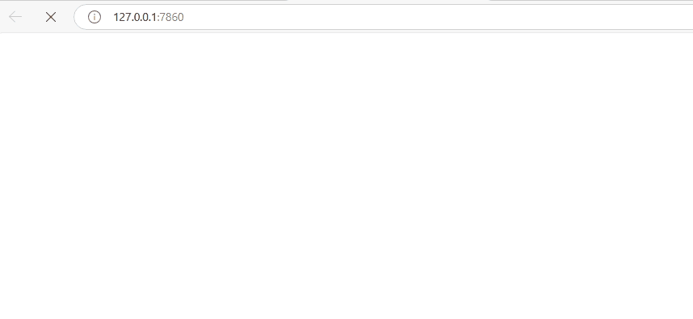

# gro Library

The `gro` library is a wrapper around the excellent Gradio library that simplifies the creation of any persistent single-user UI application. It provides a way to separate the UI from the logic, making it easier to maintain and test the application.  

It provides a `Block` class for to contain the UI elements with `gro` wrapped Gradio objects, and defining their layout. The logic itself can be defined in a separate model class, and UI to event listener mappings can be defined in a separate app class.

## Quick Start
### Installation
Use pip:

```bash
pip install git+https://github.com/aliakyurek/gro.git
```

### How to use

Define the set of UI elements in a UI class inheriting from gro.Block.
* Use any Gradio component with its parameters as usual with the `gro.Wrapper`.
  * See `grow(gr.Textbox, show_label=False, placeholder="E.g. Buy groceries")`.
* Build the layout by implementing `layout()` method in the UI class.
  * You can use both grow and Gradio components in the layout.
  * See `layout()` method.

```python
from gro import Wrapper as grow
from gro import Block
import gradio as gr

class HelloBlock(Block):
    todo_textbox = grow(gr.Textbox, show_label=False, placeholder="E.g. Buy groceries")
    add_button = grow(gr.Button, value="Add task")
    tasks_markdown = grow(gr.Markdown)

    def layout(self):
        with gr.Row():
            with gr.Column(scale=1):
                with gr.Group():
                    self.todo_textbox()
                    self.add_button()
            with gr.Column(scale=4):
                gr.Markdown("### Tasks")
                self.tasks_markdown()
```

Implement the model. This is where the logic of the application resides.

```python
class Todo:
    def __init__(self):
        self.tasks = []

    def add_task(self, task):
        self.tasks.append({"task": task, "completed": False})

    def get_task_markup(self):
        return "\n".join(f"- {t['task']}" for t in self.tasks if not t["completed"])
```

Now outline the application. This is where the UI and model are tied together.
* Instantiate the UI and model.
  * Parameters passed to the HelloBlock, passed to the Gradio Block constructor.
  
* Attach event listeners.
  * Implement event listeners in outside the UI class and bind them to the UI elements.
  * See `self.ui.add_button.click` in the `Application` class example.
  * Multiple event handlers are supported that utilizes `then` method of Gradio code.
  * See how multiple listeners binded for `ui.add_button`.
  
* When the page is refreshed or closed/reopend all the state is normally lost if a Gradio state structure is not used. As we operate with a model, we can persist the state in the model and update UI from it. This is done by binding so called a data source function from model (or application) to a UI element.
  * See `self.ui.tasks_markdown.source` in the `Application` class example.

* Finally call the `start()` method of the UI to start the application. This function is blocking and will return when the application is closed.
  * As the HelloBlock utilizes Gradio Block under the hood, `launch` parameters can be passed to UI constructor.

```python
class Application:
    def __init__(self):
        self.todo = Todo()

        # ui configuration
        self.ui = HelloBlock(title="gro Todo App")

        # populate some initial data for model
        self.todo.add_task("Wake up at 8. (Default task)")

        # ui <-> model configuration
        # bind data source
        self.ui.tasks_markdown.source(self.todo.get_task_markdown)

        # set event listeners
        self.ui.add_button.click(fn=self.add_button_click, inputs=[self.ui.todo_textbox],
                                 outputs=[self.ui.tasks_markdown])
        self.ui.add_button.click(fn=self.add_button_click_then, outputs=[self.ui.todo_textbox], show_progress="hidden")
        
    def add_button_click(self, task):
        # Handles the event when the add button is clicked to update tasks_markdown.
        self.todo.add_task(task)
        return self.todo.get_task_markdown()
    
    def add_button_click_then(self):
        # Handles the event when the add button is clicked to clear the todo_textbox.
        return ""

    def run(self):
        # following should be the last call as it doesn't return.
        self.ui.start(inbrowser=True)

if __name__ == "__main__":
    app = Application()
    app.run()
```

## Demo


## License

This project is licensed under the MIT License.